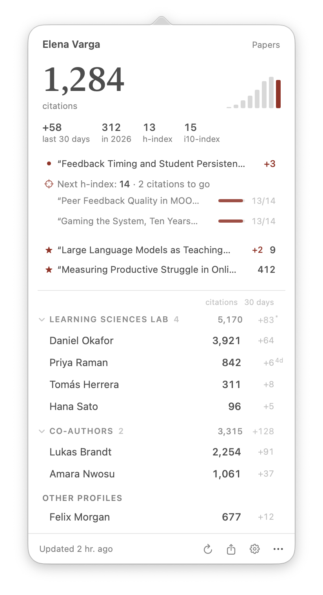
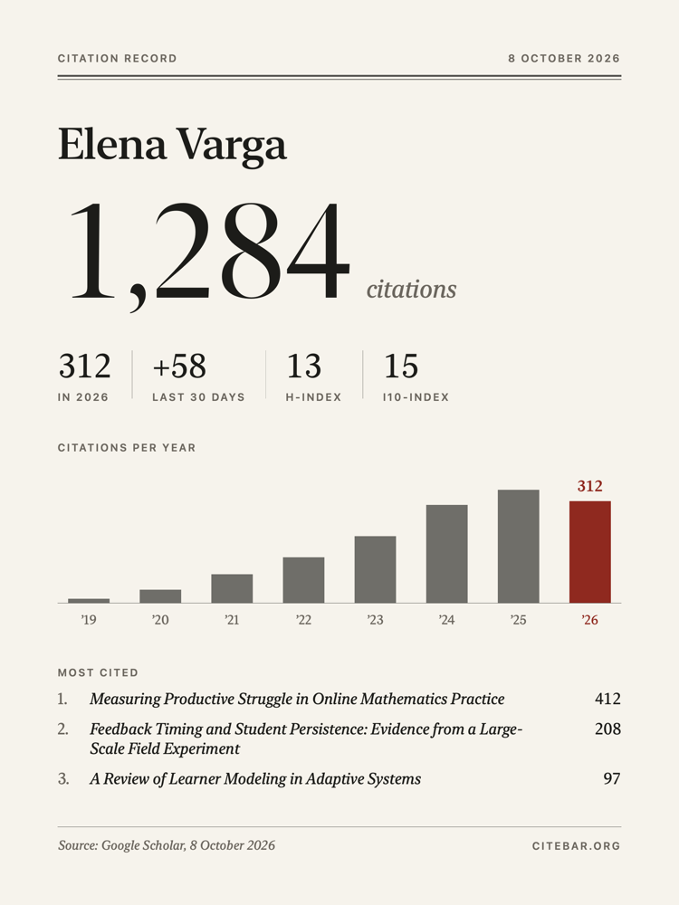
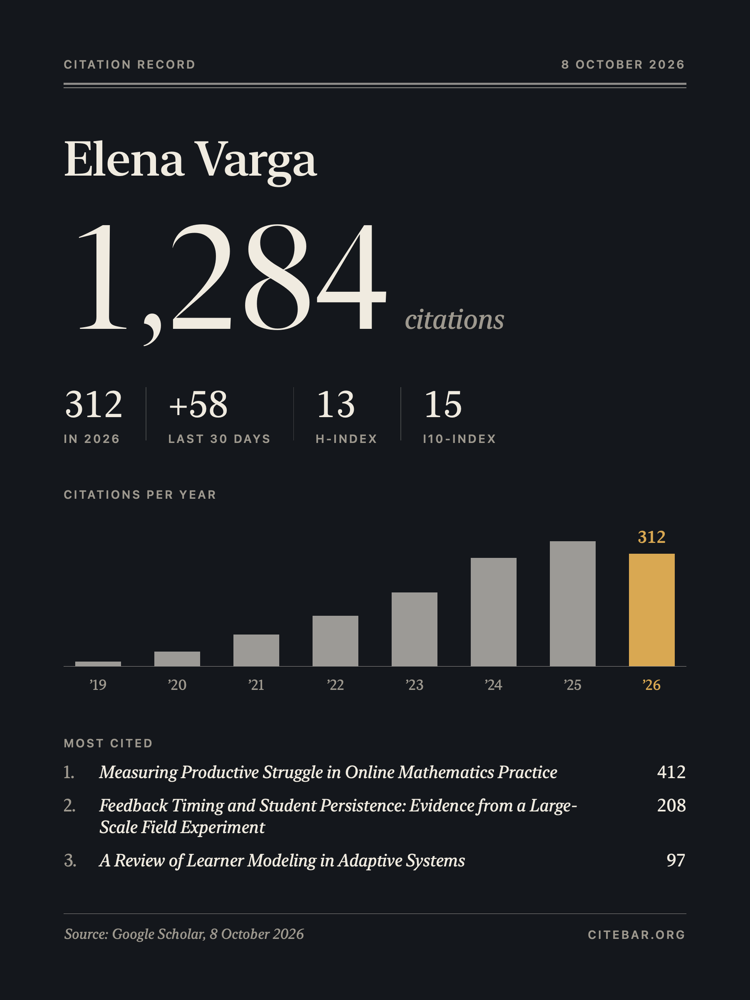
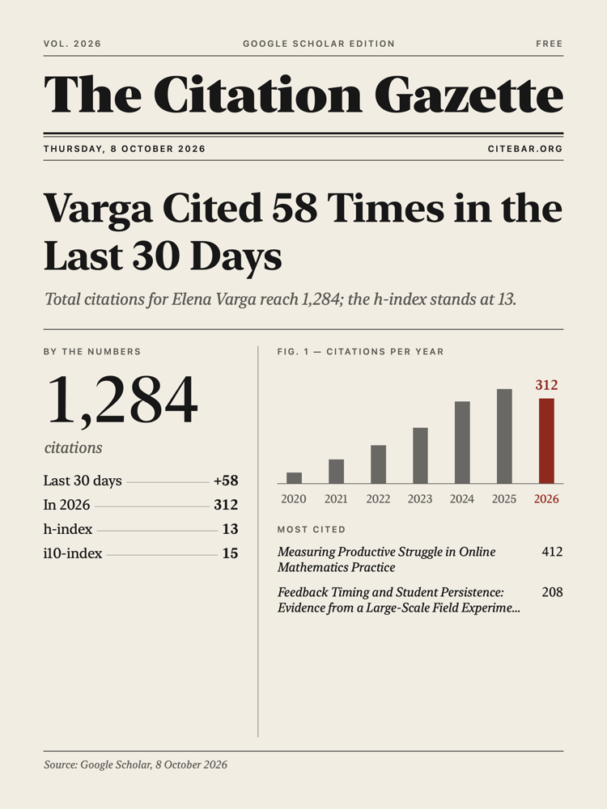
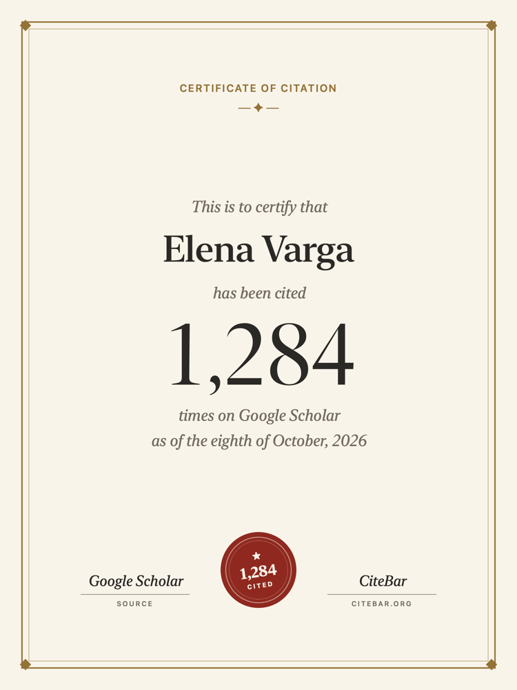

<div align="center">

[English](README.md) · **简体中文**


# CiteBar

**别再刷新 Google Scholar 了。**<br>
献给每一个忍不住查看引用的人。

[下载](https://github.com/hichipli/CiteBar/releases/latest) · [官网](https://www.citebar.org/) · `brew install --cask hichipli/tap/citebar`

  [](https://github.com/hichipli/CiteBar/releases)
  [](https://www.apple.com/macos/)
  [](https://swift.org)
  [](LICENSE)
  [](https://github.com/hichipli/CiteBar/releases)


</div>

---

## 为什么用 CiteBar？

每二十分钟刷新一次 Google Scholar 主页，并不能让研究进展得更快。CiteBar 把那个让人忍不住反复刷新的浏览器标签页，变成菜单栏里一个安静的小伙伴：每天检查一次，告诉你刚刚是哪篇论文被引用了，其余时间不打扰你。

适合关心论文影响力的研究者、正在庆祝第一次被引用的博士生、想随时了解整个课题组情况的导师，以及每一个曾经想过"我的 h-index 是不是刚涨了？"的人。

## 快速开始

**只想直接用？** 跳过技术细节，大约一分钟就能用上。

1. **下载最新版本**
   - 打开 [GitHub Releases](https://github.com/hichipli/CiteBar/releases/latest)。
   - 下载 `CiteBar-x.x.x-universal-[日期].dmg` 文件。
   - 这个通用版 DMG 同时支持 Apple 芯片和 Intel 芯片的 Mac。
   - 习惯用 Homebrew？运行 `brew install --cask hichipli/tap/citebar`，第 1、2 步会自动完成。

2. **安装 CiteBar**
   - 打开 DMG。
   - 把 `CiteBar.app` 拖进 `Applications`（应用程序）文件夹。
   - 从 `Applications` 启动 CiteBar。

3. **添加你的主页**
   - 首次启动时，CiteBar 会打开 Add Profiles 窗口。粘贴你的 Google Scholar 个人主页链接即可。
   - 想关注整个课题组或合作者？一次粘贴所有人的链接，每行一个，再把他们放进同一个分组。
   - 默认每天刷新一次。Google Scholar 本身每一两天才更新一次，所以每天刷新就足以保持最新。

你可以粘贴完整的主页链接，也可以只粘贴 ID，也就是链接里 `user` 后面的那一串：

```text
https://scholar.google.com/citations?user=YOUR_ID_HERE
```

当前版本都使用 Apple Developer ID 签名，并经过 Apple 公证（notarize）。对于从网上下载的 App，macOS 首次打开时仍可能弹出一次常规确认。

如果你正在从 `1.3.x` 或 `1.4.1` 升级，请手动安装一次最新的 DMG。之后 App 内的自动更新就会正常工作。

安装遇到问题？请看[安装指南](DISTRIBUTION.md)（英文）。

## 主要功能



**不只是一个数字**
- 引用数常驻菜单栏，点一下展开面板
- 每年引用数、今年的引用数、近 30 天增长、h-index 和 i10-index
- 看到刚被引用的是哪篇论文，一键跳转查看是谁引用了它
- h-index 快要上涨时，准确告诉你是哪几篇论文、各自还差几次引用
- 关注特定论文：在 Papers 窗口里给论文加星，它们会一直显示在面板里，有新引用时也会在通知里排在最前面
- 每一列都有标签，鼠标悬停还有说明，每个数字都看得懂

**为课题组和合作者准备的分组**
- 把主页分组为课题组、合作者或同届同学，显示合计引用数和近 30 天增长
- 一次粘贴一整串 Scholar 链接
- 复制整个分组的链接发给组里同学，他们粘贴进自己的 CiteBar 就能看到同样的分组

**值得点开的通知**
- 通知会写明是哪篇论文多了引用
- 引用数达到 100、1,000 这样的里程碑，或者 h-index 上涨，会单独提醒
- "没有变化"这种消息不会打扰你

**值得分享的引用记录**
- 四种卡片风格：Record、Night、Gazette（报纸头版风格，标题根据你的数据自动生成）和 Certificate（证书）
- 自由选择显示内容：每年引用数、h-index、引用最多的论文或某一篇论文、7 到 365 天的增长，以及一句附言
- 一键分享（隔空投送、信息、邮件）、复制或保存；可以从面板打开，也可以从设置里任意一个人的 ⋯ 菜单打开

   

**属于你的引用时间机器**
- 沿着时间轴拖到任意一天，生成那一天的卡片
- 引用里程碑和 h-index 上涨都会被标出来，错过的高光时刻也能补发
- 第一天就能用：安装 CiteBar 之前的里程碑，会根据 Google Scholar 的每年引用数估算日期并标上 ~；从安装那天起，每一天都精确记录

**克制又可靠**
- 每个主页只发一次请求，请求之间间隔两秒
- 网络抖动会自动重试；遇到 Google Scholar 限流时逐步放慢（15 分钟到 4 小时），之后自动恢复
- 随时可以点 Refresh Now 手动刷新
- 通过 Sparkle 自动更新

**默认保护隐私**
- 所有数据都留在你的 Mac 上
- 没有任何遥测
- 没有 CiteBar 服务器，也不需要注册账号

**数据随身带走**
- Settings › Data 里能看到数据存放位置（`~/Library/Application Support/CiteBar/`），以及每一部分各占多少空间：引用历史、论文列表和论文历史
- 引用历史默认永久保留，也可以只保留 5 年、2 年或 1 年
- 可选开启论文历史：每篇论文的引用数一有变化就记下来，时间机器里过去的日子也能显示当时的论文
- 把所有内容（主页、分组、设置和完整历史）导出成一个文件，到新 Mac 上再导入；导入只会添加，不会删除任何数据
- 可选在每次刷新后自动备份到 iCloud 云盘，或你选择的任意文件夹，比如 Google Drive 或 Dropbox

**原生的 macOS 体验**
- 轻巧地待在菜单栏，支持浅色和深色模式
- 原生设置窗口，包含 Profiles、General、Data 和 About 四个标签页
- 支持登录时自动启动
- 支持 Apple 芯片和 Intel 芯片

**轻到可以一直开着**
- 空闲时 CPU 占用几乎为零
- 只在你设定的时间间隔进行少量网络请求
- 更多实现细节见[技术说明](TECHNICAL.md)（英文）

## 隐私

CiteBar 只读取公开的 Google Scholar 个人主页。你的设置和引用历史都保存在你的 Mac 上，位于 `~/Library/Application Support/CiteBar/`。

App 使用保守的刷新间隔，请求之间留有间隔，出错后会主动退避，以负责任的方式查询引用数。

## 帮助与项目文档

- 安装问题或 macOS 安全提示：[安装指南](DISTRIBUTION.md)
- 从源码构建：[构建指南](SETUP.md)
- Bug 反馈和功能建议：[GitHub Issues](https://github.com/hichipli/CiteBar/issues)
- 版本变化：[更新日志](CHANGELOG.md)

以上文档均为英文。

有想法、不成熟的功能建议，或者 CiteBar 还没能很好支持的工作流程？欢迎开一个 issue，用中文写也可以。不需要准备完善的方案或 pull request，来自真实科研场景的实际反馈本身就很有价值。

## 开发者与贡献者

想从源码构建、贡献代码，或者了解 CiteBar 的内部实现？

```bash
git clone https://github.com/hichipli/CiteBar.git
cd CiteBar
make build
make run
```

相关项目文档（英文）：

- [贡献指南](CONTRIBUTING.md)
- [技术说明](TECHNICAL.md)
- [发布指南](RELEASING.md)
- [版本管理](VERSION_MANAGEMENT.md)

## 许可证

CiteBar 以 [MIT License](LICENSE) 开源。

## 社区

感谢每一位让 CiteBar 变得更好的朋友。

<div>
  <a href="https://github.com/CassWang1"></a>
  <a href="https://github.com/lukestein"></a>
  <a href="https://github.com/DABH"></a>
  <a href="https://github.com/yizirui"></a>
</div>

---

<div align="center">

**用心为学术圈打造**

[下载最新版本](https://github.com/hichipli/CiteBar/releases/latest) | [反馈问题](https://github.com/hichipli/CiteBar/issues) | [参与贡献](CONTRIBUTING.md)

</div>
